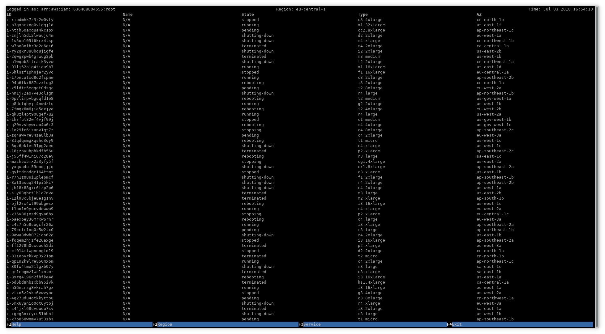

### aws-top is in an very early stage. You'll experience bugs and miss a lot of features. Feel free to open issues anyway.

aws-top is a CLI dashboard for a variety of AWS services.



Currently supported services:
- EC2
- Lambda
- S3

## Installation
1.
```commandline
$ pip install aws-top
```
2.
```commandline
$ git clone https://github.com/brennerm/aws-top && cd aws-top
$ python setup.py install
```

## Usage
### Authentication
Refer to the [boto3 configuration](https://boto3.readthedocs.io/en/latest/guide/configuration.html#credentials) to see all options to provide AWS credentials.
In general these should be prefered. Alternatively you can use the command line parameters that are listed below.
```commandline
$ aws-top -h
usage: awstop [-h] [-a ACCESS_KEY] [-s SECRET_KEY] [-S SESSION_TOKEN]
                 [-r REGION]

optional arguments:
  -h, --help            show this help message and exit
  -a ACCESS_KEY, --access-key ACCESS_KEY
  -s SECRET_KEY, --secret-key SECRET_KEY
  -S SESSION_TOKEN, --session-token SESSION_TOKEN
  -r REGION, --region REGION
```
### Execution
```commandline
$ aws configure # can be skipped if already configured
$ aws-top
```
